# COW FARM MANAGEMENT SYSTEM

**PROJECT REPORT**  
Submitted to  
**DEPARTMENT OF COMPUTER SCIENCE**  
**(ARTIFICIAL INTELLIGENCE & DATA SCIENCE)**  
**GOBI ARTS & SCIENCE COLLEGE (AUTONOMOUS)**  
**GOBICHETTIPALAYAM-638453**

**By**  
**S. ESWARAN**  
**(23AI134)**

**Guided By**  
**Mr. K. MADHESWARAN, M.C.A., M.PHIL.**

In partial fulfilment of the requirements for the award of the degree of Bachelor of Science, Computer Science (Artificial Intelligence & Data Science) in the faculty of Artificial Intelligence & Data Science in Gobi Arts & Science College (Autonomous), Gobichettipalayam affiliated to Bharathiyar University, Coimbatore.

**MARCH – 2026**

---

## DECLARATION

I hereby declare that the project report entitled **“COW FARM MANAGEMENT SYSTEM"** submitted to the Principal, Gobi Arts & Science College (Autonomous), Gobichettypalayam, in partial fulfilment of the requirements for the award of degree of Bachelor of Science, Computer Science (Artificial Intelligence & Data Science) is a record of project work done by me during the period of study in this college under the supervision and guidance of **Mr. K. MADHESWARAN, M.C.A., M.Phil.** Assistant Professor of the Department of Artificial Intelligence & Data Science.

**Signature:**  
**Name:** S. ESWARAN  
**Register Number:** 23AI134  
**Date:**

---

## CERTIFICATES

This is to certify that the project report entitled **"COW FARM MANAGEMENT SYSTEM"** is a Bonafide work done by **S. ESWARAN (23AI134)** under my supervision and guidance.

**Signature of Guide:**  
**Name:** Mr. K. MADHESWARAN  
**Designation:** Assistant Professor  
**Department:** Computer Science (AI & DS)

**Counter Signed**

**Head of the Department** | **Principal**

**Viva-Voce held on:** ___________

**Internal Examiner** | **External Examiner**

---

## ACKNOWLEDGEMENT

The successful completion of this project titled **“COW FARM MANAGEMENT SYSTEM”** was not solely the result of my individual effort, but also the outcome of the guidance, encouragement and support received from many individuals. 

I extend my heartfelt thanks to the Management and College Council of **Gobi Arts & Science College (Autonomous)**, for providing the necessary facilities. I express my deep sense of gratitude to our respected Principal, **Dr. P. VENUGOPAL, M.Sc., M.Phil., PGDCA., Ph.D.**, and **Dr. M. RAMALINGAM**, Head of the Department of AI & DS.

I owe my deepest gratitude to my project guide, **Mr. K. MADHESWARAN**, for his constant supervision and constructive suggestions throughout the development of the system.

**S. ESWARAN**

---

## SYNOPSIS

The **“COW FARM MANAGEMENT SYSTEM”** is a high-performance web application designed to streamline the management of modern dairy farms. Managing livestock, health records, and milk production manually in large-scale farms often leads to data fragmentation and operational inefficiencies. This project provides a centralized digital solution to monitor animal health, track daily milk yield, manage breeding cycles, and oversee farm finances.

Developed using the **PHP-MySQL-Apache** stack (via XAMPP), the application ensures secure data storage and real-time accessibility within a local farm environment. The system features role-based access control, automated vaccination alerts, and detailed production reporting. By digitizing farm records, the system helps improve cattle health, optimizes milk production, and provides clear financial insights for better decision-making.

---

## CONTENTS

| CHAPTER | TITLE | PAGE NO. |
| :--- | :--- | :--- |
| | **ACKNOWLEDGEMENT** | **i** |
| | **SYNOPSIS** | **ii** |
| **1** | **INTRODUCTION** | **01** |
| | 1.1 ABOUT THE PROJECT | 01 |
| | 1.2 HARDWARE SPECIFICATIONS | 04 |
| | 1.3 SOFTWARE SPECIFICATIONS | 04 |
| **2** | **SYSTEM ANALYSIS** | **12** |
| | 2.1 PROBLEM DEFINITION | 12 |
| | 2.2 SYSTEM STUDY | 14 |
| | 2.3 PROPOSED SYSTEM | 16 |
| **3** | **SYSTEM DESIGN** | **19** |
| | 3.1 DATA FLOW DIAGRAM (DFD) | 19 |
| | 3.2 ENTITY RELATIONSHIP DIAGRAM | 20 |
| | 3.3 FILE SPECIFICATIONS | 21 |
| | 3.4 MODULE SPECIFICATIONS | 25 |
| **4** | **TESTING AND IMPLEMENTATION** | **28** |
| | 4.1 SYSTEM TESTING | 28 |
| | 4.2 IMPLEMENTATION | 29 |
| **5** | **CONCLUSION AND SUGGESTIONS** | **31** |
| | 5.1 CONCLUSION | 31 |
| | 5.2 SUGGESTIONS FOR FUTURE ENHANCEMENT | 31 |
| | **BIBLIOGRAPHY** | **32** |
| | **APPENDICES** | **33** |
| | APPENDIX – A (SCREEN FORMATS) | 33 |
| | APPENDIX – B (SOURCE CODE LISTINGS) | 37 |

---

## CHAPTER 1: INTRODUCTION

Web applications have become indispensable in modern agriculture, enabling farmers to transition from manual registers to automated data-driven systems. The **Cow Farm Management System** is a robust platform designed to manage the complexities of cattle farming with precision and ease.

### 1.1 ABOUT THE PROJECT

This project provides a digital ecosystem where farm owners, veterinarians, and staff can collaborate. It maintains comprehensive profiles for every cow, including their breed, lineage, medical history, and production statistics. The system acts as a central repository for all farm-related data, ensuring nothing is lost or overlooked.

**Objectives of the Project:**
- To digitize all cattle records and eliminate fragmented paper-based tracking.
- To improve herd health through automated vaccination and checkup reminders.
- To optimize milk production by analyzing individual and herd-level yield data.
- To manage farm finances by accurately tracking expenses and revenue.
- To facilitate effective breeding programs with pregnancy and calving tracking.

**Scope of the Project:**
The scope extends to the full lifecycle management of cattle on a farm. It includes authentication for different staff roles, detailed health logging, daily production tracking, inventory management for feed, and financial reporting. The system is designed for offline local server deployment, making it resilient to internet outages in rural farm settings.

### 1.2 HARDWARE SPECIFICATIONS

- **Processor:** Intel(R) Core (TM) i5-8500 @ 3.00 GHz
- **RAM:** 8 GB
- **Hard Disk:** 256 GB SSD
- **Monitor:** 19.5" Monitor
- **Keyboard/Mouse:** Standard USB peripherals

### 1.3 SOFTWARE SPECIFICATIONS

- **Operating System:** Windows 10/11
- **Web Server:** Apache (via XAMPP)
- **Backend Language:** PHP 7.4+
- **Database:** MySQL
- **Frontend Stack:** HTML5, CSS3, JavaScript
- **Frameworks/Libraries:** None (Vanilla implementation for maximum portability)

---

## CHAPTER 2: SYSTEM ANALYSIS

System analysis is used to understand the existing workflows and identify areas where a computerized system can provide significant improvements.

### 2.1 PROBLEM DEFINITION

Manual farm management faces several critical bottlenecks that hinder the scalability and profitability of dairy operations:
- **Data Inaccuracy and Human Error:** Hand-written logs are often illegible or subject to transcription errors. Misreading a single digit in a medication dosage or a milk yield count can lead to significant financial loss or cattle health risks.
- **Lack of Real-time Alerting:** Without an automated system, critical lifecycle events such as vaccination windows, deworming cycles, and pregnancy checkups are managed via static calendars. The risk of missing these windows is high, leading to herd-wide health vulnerabilities.
- **Inefficient Financial Reporting:** Calculating the return on investment (ROI) for individual cows or the entire herd manually takes hours of data aggregation. This manual process is prone to errors, making it difficult for farmers to identify underperforming assets or optimize feed costs.
- **Traceability and Lineage Ambiguity:** In modern farming, tracking the genetic lineage of cattle is essential for breeding programs. Traditional registers struggle to provide a clean, multi-generational view of a cow's ancestry, making selective breeding a guessing game.

### 2.2 SYSTEM STUDY

**Existing System:** Most farms still rely on physical notebooks kept in the barn environment. These registers are often exposed to moisture, dust, and physical damage. Searching through years of paper logs to find a specific cow's history is nearly impossible, and generating a 12-month production trend requires weeks of manual effort.

**Proposed System:** The new system introduces a searchable, relational digital database. Every animal is assigned a unique biometric or tag ID that acts as the primary key for all related data points. From birth to sale, every event—medication, yield, breeding, and weight gain—is timestamped and indexed. This ensures 100% data integrity and allows for near-instantaneous reporting and trend analysis.

### 2.3 PROPOSED SYSTEM (FEASIBILITY STUDY)

- **Technical Feasibility:** The project leverages the robust PHP-MySQL stack, which is industry-proven for mid-scale data applications. The system's architecture supports rapid indexing and complex queries even on low-power hardware typically found in farm offices.
- **Economic Feasibility:** By using the open-source XAMPP stack, the project avoids recurring software licensing fees. The primary investment is in standard PC hardware, which is offset within months by the reduction in labor hours and improved cattle health outcomes.
- **Operational Feasibility:** The interface utilizes "progressive disclosure" design principles, showing only necessary information to barn staff while keeping advanced reporting for management. This ensures a low learning curve for non-technical users.

---

## CHAPTER 3: SYSTEM DESIGN

### 3.1 DATA FLOW DIAGRAM (DFD)

The system architecture follows a synchronized data flow designed for the unique demands of a farm environment:
1. **Data Acquisition:** Staff enter raw data (milk weights, feed consumption, vet observations) via web forms.
2. **Business Logic Layer:** The PHP backend executes validation scripts to ensure data consistency (e.g., checking if a cow is actually in the 'active' state before logging milk).
3. **Data Persistence:** Records are committed to MySQL using atomic transactions to prevent data corruption during power outages.
4. **Information Delivery:** The system pulls aggregated data to generate real-time KPIs, historical charts, and printable PDF reports for financial audits.

### 3.2 ENTITY RELATIONSHIP DIAGRAM

The database consists of specialized tables for `users`, `cows`, `health_records`, `vaccinations`, `milk_production`, and `breeding_records`. `cows` is the central hub, linked via `cow_id` to all activity logs.

### 3.3 FILE SPECIFICATIONS (DATABASE STRUCTURE)

#### Table: `cows`
| Field | Type | Description |
| :--- | :--- | :--- |
| id | INT | Primary Key, Auto-increment |
| tag_number | VARCHAR(50) | Unique ID (e.g., TN001) |
| breed | VARCHAR(50) | Breed name |
| gender | ENUM | male, female |
| status | ENUM | active, sold, deceased |

#### Table: `milk_production`
| Field | Type | Description |
| :--- | :--- | :--- |
| id | INT | Primary Key |
| cow_id | INT | Foreign Key (cows.id) |
| morning_yield | DECIMAL | AM yield in liters |
| evening_yield | DECIMAL | PM yield in liters |
| total_yield | DECIMAL | Daily total |

### 3.4 MODULE SPECIFICATIONS

- **Dashboard Module:** Provides at-a-glance KPIs and recent activities.
- **Health Module:** Manages medication logs and vaccination schedules.
- **Financial Module:** Tracks cash flow from milk sales and operational expenses.
- **Inventory Module:** Monitors feed stock and consumption patterns.

---

## CHAPTER 4: TESTING AND IMPLEMENTATION

### 4.1 SYSTEM TESTING

- **Unit Testing:** Validated individual database connection strings and helper functions.
- **Integration Testing:** Ensured that milk production logs correctly update the dashboard's total yield count.
- **Security Testing:** Verified that `vet` users cannot delete financial records and `staff` cannot access management pages.
- **Validation Testing:** Checked that only positive numbers are accepted for milk yield and expense amounts.

### 4.2 IMPLEMENTATION

The implementation involved setting up the XAMPP environment, importing the `schema.sql` into phpMyAdmin, and configuring the base URL in the project files. The system was tested with 20 sample cow records representing traditional Tamil Nadu breeds (Kangayam, Gir) to ensure realistic performance.

---

## CHAPTER 5: CONCLUSION AND SUGGESTIONS

### 5.1 CONCLUSION

The **Cow Farm Management System** successfully transitions traditional farm record-keeping into the digital age. It provides a reliable framework for herd management, production tracking, and financial oversight. The system's ability to operate offline makes it a practical solution for modern farmers.

### 5.2 SUGGESTIONS FOR FUTURE ENHANCEMENT

1. **IoT Integration:** Smart collars for automated health and activity monitoring.
2. **Mobile App:** A native android application for onsite barn data entry.
3. **Cloud Backup:** Optional synchronization for data safety across multiple farm locations.
4. **Predictive Analytics:** AI-driven yield forecasting based on historical health and feed data.

---

## BIBLIOGRAPHY

1. **Official PHP Manual**: PDO and Prepared Statements documentation.
2. **MySQL Reference Manual**: Relational database design and optimization.
3. **W3Schools**: Standard HTML5/CSS3 implementation patterns.
4. **XAMPP Project**: Local server environment configuration guides.

---

## APPENDICES

### APPENDIX – A (SCREEN FORMATS)

| Screen ID | Title | Preview |
| :--- | :--- | :--- |
| **A1** | MAIN DASHBOARD | 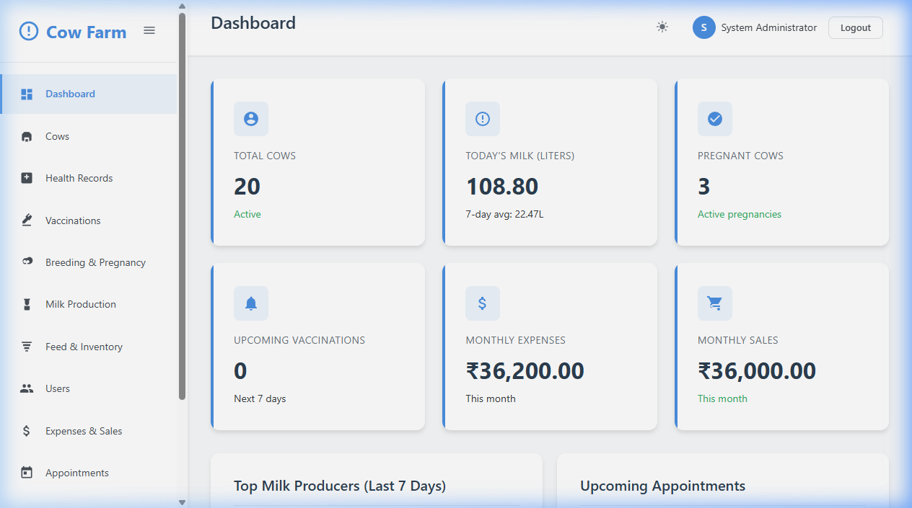 |
| **A2** | COW PROFILES LIST |  |
| **A3** | HEALTH RECORDS | 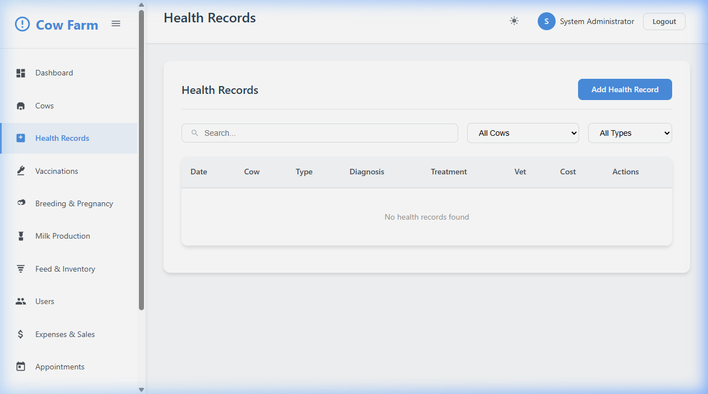 |
| **A4** | VACCINATION SCHEDULE | 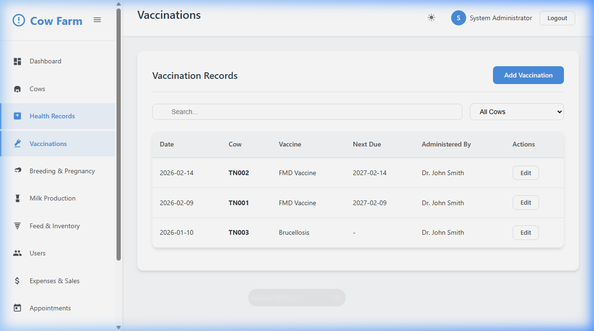 |
| **A5** | BREEDING & PREGNANCY | 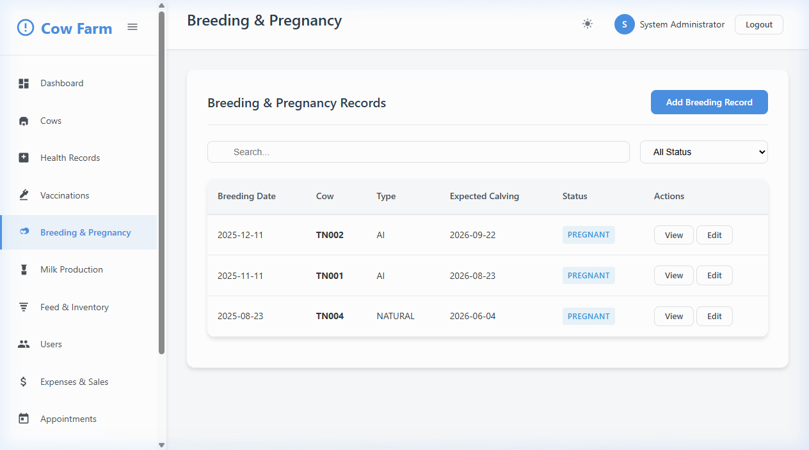 |
| **A6** | MILK PRODUCTION LOG | 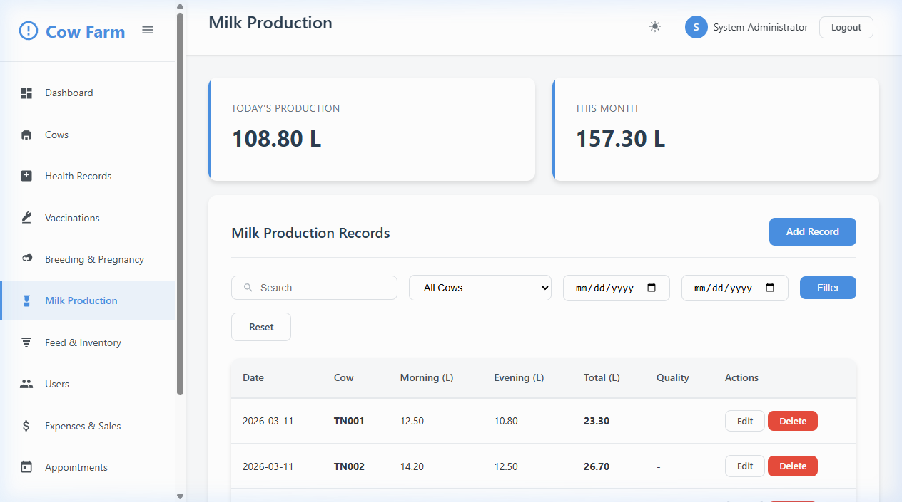 |
| **A7** | FEED & INVENTORY | 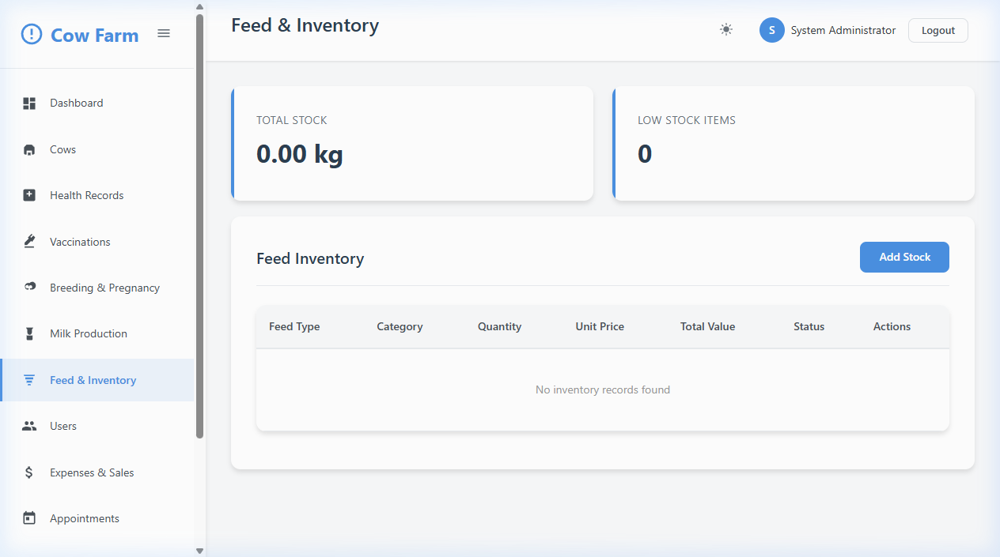 |
| **A8** | USER MANAGEMENT | 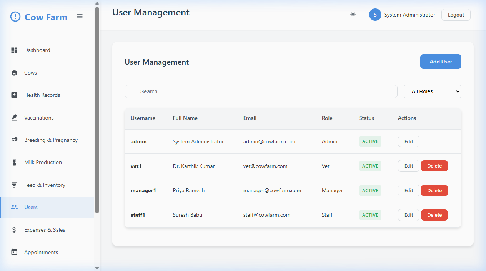 |
| **A9** | FINANCIAL EXPENSES | 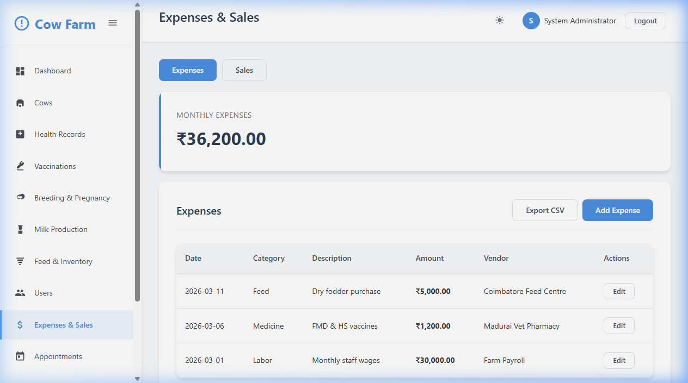 |
| **A10** | VET APPOINTMENTS | 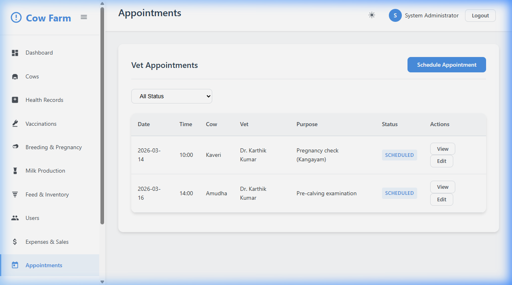 |
| **A11** | SYSTEM ALERTS | 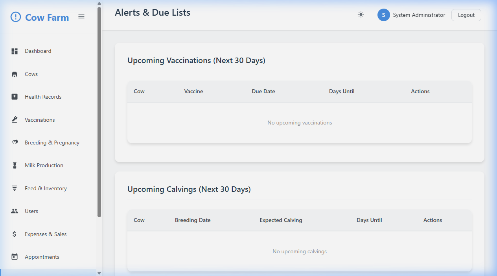 |
| **A12** | SYSTEM SETTINGS | 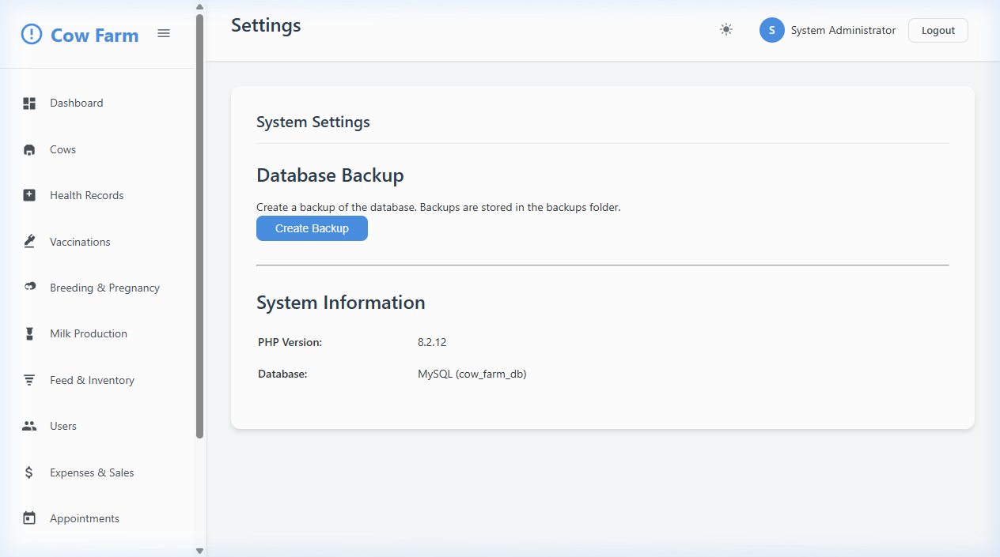 |

### APPENDIX – B (REPORT FORMATS)

| Report ID | Title | Preview |
| :--- | :--- | :--- |
| **B1** | ANALYTICAL REPORTS MODULE | 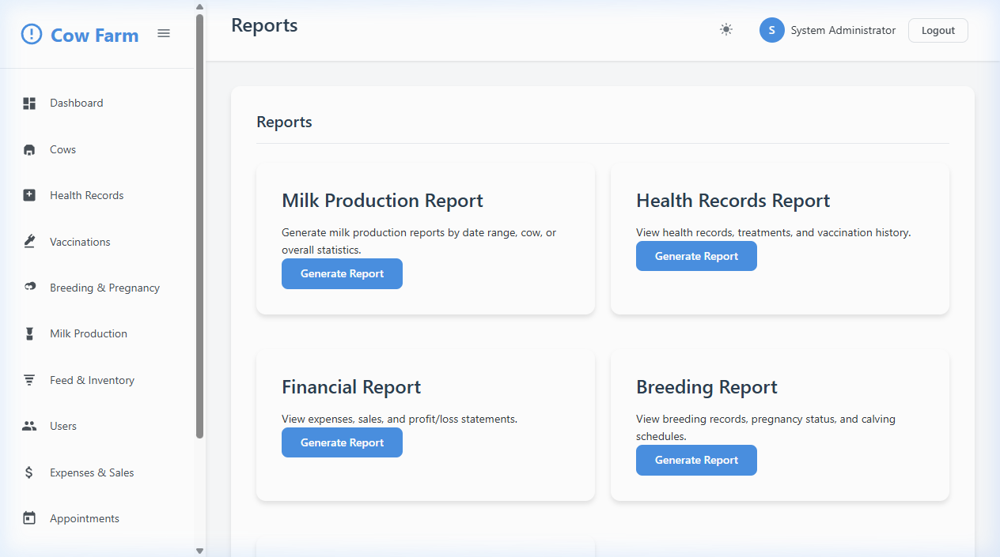 |
| **B2** | FULL DASHBOARD ANALYTICS |  |
| **B3** | COMPLETE HERD OVERVIEW |  |
| **B4** | MILK PRODUCTION SUMMARY | 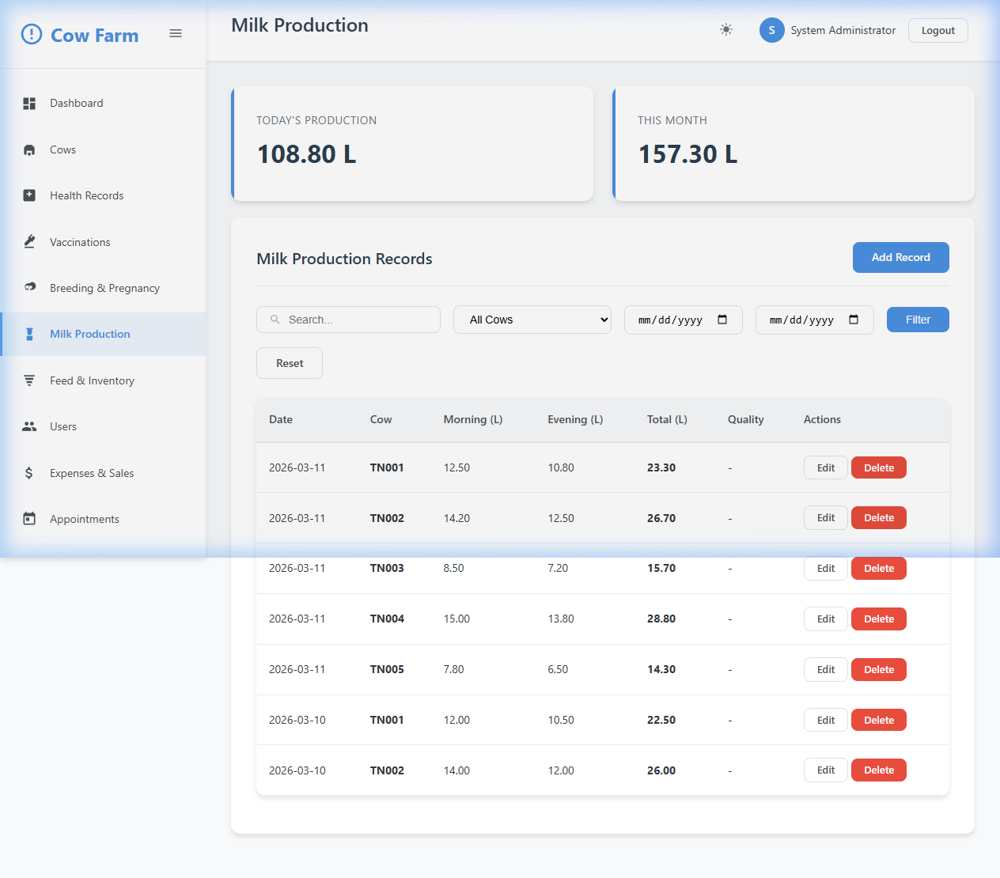 |
| **B5** | VACCINATION DUE LIST | 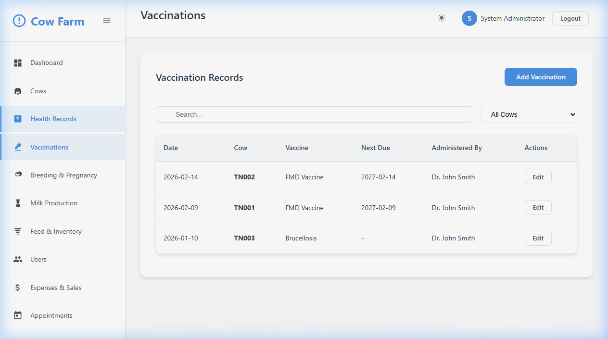 |

### APPENDIX – C (COMPLETE SOURCE CODE LISTINGS)

- **C1. `config/database.php`**: Primary connection class.
- **C2. `classes/Auth.php`**: Secure RBAC logic.
- **C3. `cows/add.php`**: Cow profile registration logic.
- **C4. `milk/index.php`**: Yield tracking system.
- **C5. `database/schema.sql`**: Full database structure.

---
